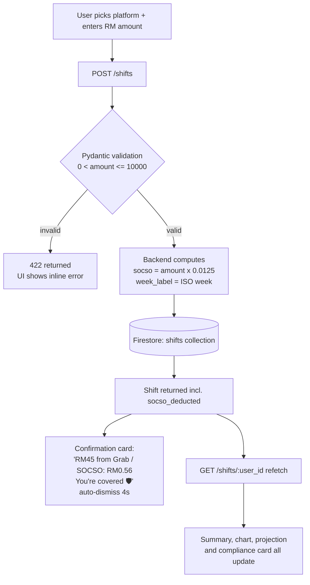
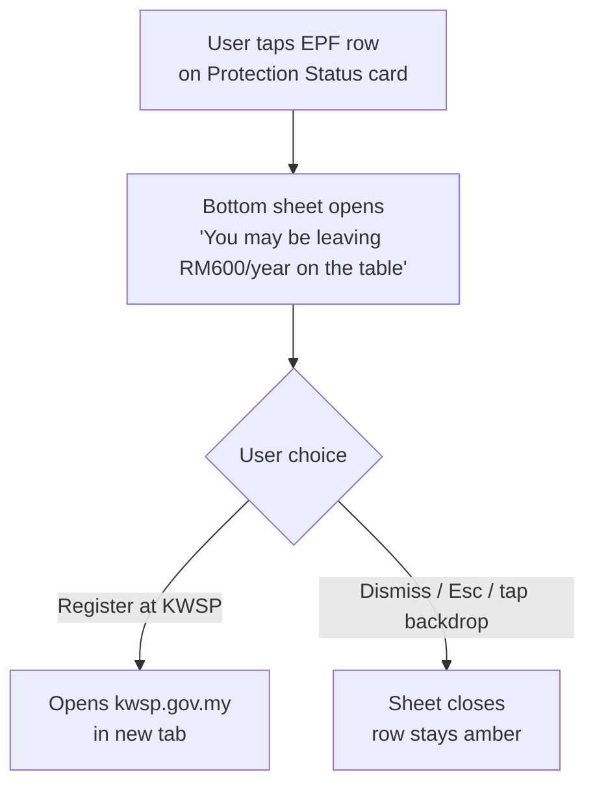

# GigShield MY — Technical Documentation

## 1. Approach

This app was built in response to a real legislative gap. The Gig Workers Act 2025 came into force in March 2026, making SOCSO contributions mandatory for ~1.2 million Malaysian gig workers. No consumer tool existed to help them understand what that means per shift. The closest global product, ShiftTracker (US), is built entirely around IRS tax mechanics and is irrelevant to Malaysian workers. This app fills that gap with the simplest possible interface — log a shift, see your coverage, understand your rights.

The build was scoped as a solo 4-day sprint with strict scope discipline: two core features, no AI, no platform API integrations (Grab and Foodpanda do not expose earnings data), no Telegram bot. I planned the build as seven sequential increments — scaffold, data models, income logger, compliance card, projection panel, auth and deployment, documentation — and verified each worked before starting the next. The target user is a rider on a phone, mid-shift, with seconds to spare, so every interface decision (pill buttons over dropdowns, no login screen, one-tap logging) flows from that constraint.

## 2. Why this tech stack

- **React + Vite:** fast iteration, instant HMR, and a production build measured in seconds — essential for a 4-day window. I have shipped React on Vercel before (KAWAL, Solare), so there was zero ramp-up cost.
- **Tailwind CSS v4:** design tokens live in one `@theme` block; the entire dark UI is utility-driven with no bespoke stylesheet to maintain.
- **FastAPI:** Pydantic models give request validation and OpenAPI docs for free; SOCSO math lives server-side where it belongs.
- **Firebase Firestore + anonymous auth:** removes the entire signup funnel. A rider opens the URL and is already a user. Firestore's document model maps 1:1 to the shift-log shape, and the Admin SDK keeps all writes behind the API.
- **Vercel + Railway:** zero-config SPA hosting and a one-line Procfile for the API.

## 3. Feature 1 technical decisions — shift income logger

**SOCSO calculation lives in the backend.** `socso_deducted = round(amount × 0.0125, 2)` is computed in `POST /shifts` and stored on the shift document, never recomputed client-side. Reason: the statutory rate is a policy value; if it changes, one constant (`SOCSO_RATE` in `models.py`) changes and historical shifts keep the rate that applied when they were logged. Storing the deduction also makes each document a self-contained audit record.

**Week bucketing uses ISO week labels.** Every shift is stamped with `week_label` in `YYYY-Www` format (e.g. `2026-W24`) derived from `datetime.isocalendar()`. Aggregating "this week" is then a string equality check rather than timezone-sensitive date-range arithmetic. ISO weeks start on Monday, which matches how Malaysian gig platforms cycle weekly incentives.

**Aggregation is computed server-side per request, not stored.** With one user's realistic volume (tens of shifts per week) a read-and-fold is simpler and always consistent; a denormalised counters document would add write complexity for no measurable gain at this scale. The endpoint returns both the raw shift list and the summary so downstream features need no extra calls.

**Edge cases handled:** amounts validated to `0 < amount ≤ 10,000` and rounded to sen; empty `user_id` rejected with 400; failed saves surface a retryable error message rather than silently dropping the shift; the amount input is `inputMode="decimal"` so phone keyboards open with a number pad.

## 4. Feature 2 technical decisions — compliance status card

**Why frontend-only.** All three status rows are pure functions of data the dashboard has already fetched. SOCSO status is `shift_count_this_week > 0`; the EPF and EIS rows are static policy explainers. Adding endpoints would mean an extra network round-trip to compute booleans the client can derive instantly — and the card must update the moment a shift is logged, which a local derivation gives for free.

**Why no login.** The target user will not create an account to try a tracker. Firebase anonymous auth issues a stable UID per device on first load, which becomes the `user_id` for all API calls. The trade-off — data is bound to the device — is disclosed in the footer ("Your data is stored privately by device"). Honest framing of EPF status follows the same principle: the app cannot verify i-Saraan registration, so that row is permanently amber with a tap-through to KWSP rather than a false green.

## 5. Key flowcharts

### Flow 1 — Logging a shift

### Flow 2 — EPF i-Saraan Plus nudge

## 6. Budget 2026 policy accuracy notes

**SOCSO subsidy — scoping clarification.** Budget 2026 includes a 70% PERKESO contribution subsidy for first-time registrants in non-mandatory sectors, and 50% in their second year. This subsidy does **not** apply to platform delivery riders and e-hailing drivers — their PERKESO contributions are already mandatory under Act 872 and are deducted directly by the platform at 1.25% per shift under Act 789. The subsidy is targeted at self-employed workers in sectors where SOCSO registration remains voluntary. GigShield MY's in-app copy reflects this distinction explicitly: the subsidy is not surfaced as a benefit to the app's target users, and the i-Saraan Plus EPF match is correctly identified as the relevant Budget 2026 incentive for platform workers.

**i-Saraan Plus (Budget 2026).** The government matches voluntary EPF (KWSP) contributions by eligible gig workers at up to RM600 per year (lifetime cap: RM6,000) through i-Saraan Plus. Platform delivery workers registered under Act 872 qualify. The in-app nudge (amber EPF row → bottom sheet → KWSP link) is the practical entry point.

**Zakat pendapatan.** The projection card includes an opt-in toggle for zakat on income at 2.5% of projected monthly earnings. This is an estimate only — actual obligation depends on nisab, hawl, and deductions as determined by the relevant State Religious Authority (Lembaga Zakat). The toggle is opt-in by design; zakat is personal and not universal.

## 7. What I'd build with more time

- **Telegram bot interface** — riders live in Telegram; `/log grab 45` would beat opening a browser mid-shift.
- **Platform CSV import** — Grab and Foodpanda both export weekly earnings statements; parsing them would backfill history in one upload.
- **Actual LHDN tax bracket lookup** — replace the flat 8% set-aside heuristic with a progressive calculation from projected annual income.
- **PERKESO claim guidance** — a step-by-step flow for what to do after a work accident, the moment SOCSO coverage actually matters.

## 8. Competitive context

ShiftTracker (Boise, Idaho) is the closest global comparator: a US gig-income tracker built around IRS mileage deductions and Schedule C filings — mechanics with no Malaysian equivalent. Pre-Gig Workers Act 2025 (Act 872) there was no Malaysian statutory layer to build on; post-Act, there is a mandatory 1.25% PERKESO deduction touching 1.2 million workers and a government EPF match most of them don't know exists, and no consumer product addressing either. The Malaysia-specific compliance framing is the differentiator: this is not a generic expense tracker with a Malaysian skin, it is a rights-awareness tool that happens to track income.

Act 872 came into full force on 31 March 2026 and is coordinated by **SEGIM** (Suruhanjaya Ekonomi Gig Malaysia / Malaysian Gig Economy Commission), which was established specifically for that purpose.

**EPF phasing note:** EPF contributions are not included in Act 872's first phase, though mandatory EPF savings for gig workers will be considered in later phases. This policy gap is precisely why the i-Saraan Plus voluntary contribution nudge exists as a call-to-action in GigShield MY — it surfaces the only currently available pathway to EPF savings for riders, before mandatory coverage is legislated. The app is explicit that EPF is not yet part of Act 872's Phase 1 rather than implying it is covered.
