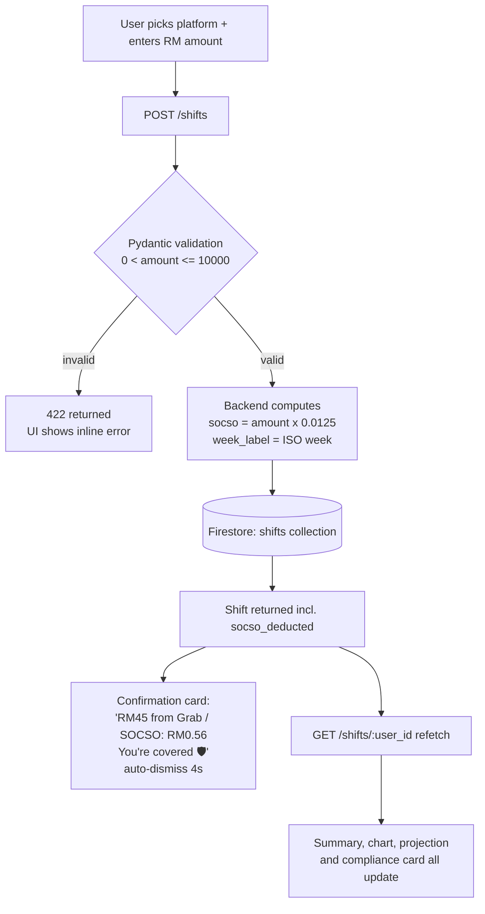
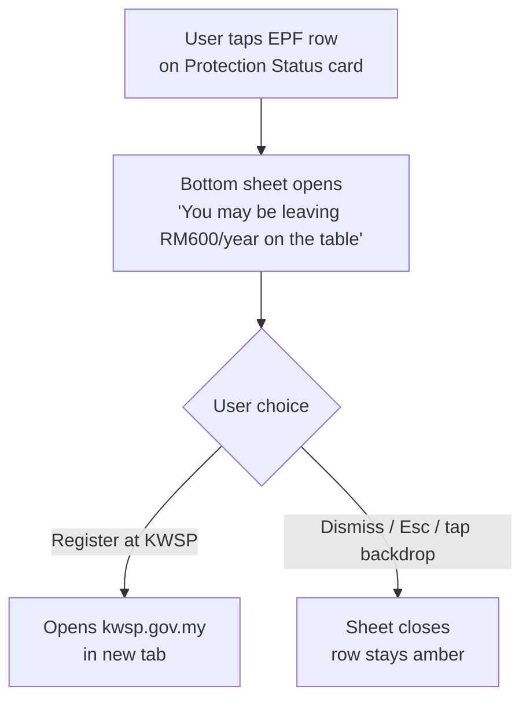

# Pelang — Technical Documentation

## 1. Approach

Pelang is a **self-proposed topic** (the brief allows this and evaluates all submissions equally): a multi-platform income and protection tracker for Malaysian gig workers. It responds to a real legislative gap — the Gig Workers Act 2025 came into force in March 2026, making SOCSO contributions mandatory for ~1.2 million gig workers at 1.25% per ride or delivery — yet no consumer tool existed to help them understand what that deduction means per shift, track cross-platform income, or see what protection they actually have. The closest global product, ShiftTracker (US), is built around IRS tax mechanics and is irrelevant to Malaysian workers.

**Scope discipline — depth over breadth.** Following the brief's "go deeper, not broader" guidance, the MVP was fixed at **two well-developed core features**: (1) a one-tap **shift income logger** with automatic SOCSO calculation, and (2) a **protection / compliance status** view tied to Act 872. The build proceeded as sequential increments — scaffold → data models → income logger → compliance card → projection → auth & deployment → documentation — each verified before the next began. Everything else (screenshot OCR, the bilingual income statement, expense tracking, demo mode — see §6) was added **only after the two core features were solid**, as unique selling points rather than half-finished extras. Notably, the initial scope deliberately excluded AI to keep the core focused; the OCR feature was a considered, later addition once the fundamentals worked.

**Target user and interface choice.** The user is a rider on a phone, mid-shift, with seconds to spare — so the interface is a mobile-first, installable **PWA**, not a desktop web app or CLI. It has to be reachable in one tap from a home screen, usable one-handed on a budget Android phone, and tolerant of patchy coverage. Every UI decision (thumb-zone actions, pill buttons over dropdowns, no login screen, one-tap logging, Touch 'n Go-style reverse-decimal amount entry) flows from that constraint.

## 2. Why this tech stack

- **React + Vite:** fast iteration, instant HMR, and a production build measured in seconds — essential for a one-week build window. I have shipped React on Vercel before (KAWAL, Solare), so there was zero ramp-up cost.
- **Tailwind CSS v4:** design tokens live in one `@theme` block; the entire dark UI is utility-driven with no bespoke stylesheet to maintain.
- **FastAPI:** Pydantic models give request validation and OpenAPI docs for free; SOCSO math lives server-side where it belongs.
- **Firebase Firestore + anonymous auth:** removes the entire signup funnel. A rider opens the URL and is already a user. Firestore's document model maps 1:1 to the shift-log shape, and the Admin SDK keeps all writes behind the API.
- **Vercel (frontend + backend):** zero-config SPA hosting for the React build, and the FastAPI app runs as a Python serverless function from the same platform — one provider, one deploy command per project.

## 3. Technical architecture overview

```
 Browser — installable PWA (React + Vite + Tailwind)
   │   Firebase Anonymous Auth → stable per-device UID
   │   fetch (JSON over HTTPS)
   ▼
 FastAPI — Python serverless function on Vercel
   │   Pydantic validation · SOCSO math · ownership checks
   │   Firebase Admin SDK (server-only credentials)
   ▼
 Firestore — shifts · expenses · users collections
        ▲
        │   Google Gemini 2.0 Flash (vision) — screenshot OCR, server-side only
```

- **Client** holds no business logic beyond presentation and derived/filtered views. It never computes SOCSO and never trusts OCR output — both come from, or are validated by, the server.
- **API** is the single source of truth for money math and the only writer to Firestore, so the Admin SDK keys never reach the browser. Endpoints: `POST /shifts`, `GET /shifts/{uid}`, `PATCH`/`DELETE /shifts/{id}`, `POST`/`GET`/`DELETE /expenses`, `POST /ocr-shift`, `GET /ping`.
- **Data** is partitioned per user by `user_id` (the anonymous UID). Aggregates (weekly totals, per-platform breakdown) are computed per request rather than denormalised — simplest and always consistent at one rider's volume.
- **Auth** is anonymous: the UID is the only identity, with no passwords or PII. This removes the signup funnel and keeps the impact of any data exposure low.

## 4. Feature 1 technical decisions — shift income logger

**SOCSO calculation lives in the backend.** `socso_deducted = round(amount × 0.0125, 2)` is computed in `POST /shifts` and stored on the shift document, never recomputed client-side. Reason: the statutory rate is a policy value; if it changes, one constant (`SOCSO_RATE` in `models.py`) changes and historical shifts keep the rate that applied when they were logged. Storing the deduction also makes each document a self-contained audit record.

**Week bucketing uses ISO week labels.** Every shift is stamped with `week_label` in `YYYY-Www` format (e.g. `2026-W24`) derived from `datetime.isocalendar()`. Aggregating "this week" is then a string equality check rather than timezone-sensitive date-range arithmetic. ISO weeks start on Monday, which matches how Malaysian gig platforms cycle weekly incentives.

**Aggregation is computed server-side per request, not stored.** With one user's realistic volume (tens of shifts per week) a read-and-fold is simpler and always consistent; a denormalised counters document would add write complexity for no measurable gain at this scale. The endpoint returns both the raw shift list and the summary so downstream features need no extra calls.

**Edge cases handled:** amounts validated to `0 < amount ≤ 10,000` and rounded to sen; empty `user_id` rejected with 400; failed saves surface a retryable error message rather than silently dropping the shift; the amount input is `inputMode="decimal"` so phone keyboards open with a number pad.

### Backdating and the logged_at immutability reversal

The first CRUD iteration made `logged_at` and `week_label` immutable on edit: the log moment was a fact, and SOCSO weekly coverage derives from `week_label`, so letting clients rewrite history looked like an integrity risk. That was the right call **until backdated logging existed**. Once the shift date is user-supplied at creation ("I rode all day Tuesday and remembered to log it Thursday night"), "I logged it on the wrong day" becomes a legitimate correction, so `PATCH /shifts/{id}` now accepts `logged_date` and recomputes both fields server-side. Bounds are enforced on the server (not future, ≤365 days back), and `week_label` is always derived from `logged_at` — never client-supplied — so weekly Protection Status stays consistent.

## 5. Feature 2 technical decisions — compliance status card

**Why frontend-only.** All three status rows are pure functions of data the dashboard has already fetched. SOCSO status is `shift_count_this_week > 0`; the EPF and EIS rows are static policy explainers. Adding endpoints would mean an extra network round-trip to compute booleans the client can derive instantly — and the card must update the moment a shift is logged, which a local derivation gives for free.

**Why no login.** The target user will not create an account to try a tracker. Firebase anonymous auth issues a stable UID per device on first load, which becomes the `user_id` for all API calls. The trade-off — data is bound to the device — is disclosed in the footer ("Your data is stored privately by device"). Honest framing of EPF status follows the same principle: the app cannot verify i-Saraan registration, so that row is permanently amber with a tap-through to KWSP rather than a false green.

## 6. Features added after the core MVP

The two features above were the original sprint scope. These were added afterwards; each kept the same constraint discipline (server owns money math, the client stays honest about what it can't verify).

**Screenshot OCR (`POST /ocr-shift`).** Riders already see their earnings on the platform's own summary screen; re-typing it is friction. The camera button compresses the photo client-side (canvas, max 1280px JPEG) to stay under Vercel's serverless body limit, then the backend forwards it to Google Gemini 2.0 Flash with a strict JSON-only prompt. The result is **sanitised, not trusted**: the amount is bounded `0 < v ≤ 10,000` and the platform is rejected unless it's a known enum value, defaulting to `other`. OCR only pre-fills the form — the user still confirms before logging — so a misread never writes bad data silently. Gemini's free tier (1,500 req/day) keeps it zero-cost; if `GEMINI_API_KEY` is unset the endpoint returns 503 and the UI hides the camera button.

**Reverse-decimal amount input.** Malaysians expect the Touch 'n Go keypad behaviour: digits fill from the right of the decimal point (type `1`,`0`,`5`,`0` → `RM10.50`). Implemented by storing a raw integer string of sen and rendering `parseInt / 100`, with an invisible overlay `<input type="tel">` so both mobile soft keyboards and desktop physical keyboards work. This removes the single most common logging error — a misplaced decimal.

**Penyata Pendapatan (income statement).** Gig workers are routinely asked for proof of income for loans and grants but have no payslip. `RecordsCard` generates a bilingual, print-ready HTML statement (platform breakdown, totals, a PERKESO/Act 872 note) and opens it via a `Blob` URL for the browser's native print-to-PDF — no server round-trip, no PDF library, and no use of the deprecated `document.write`.

**Custom platforms.** The preset list can't cover every operator (e.g. Bolt). Users add their own in Settings; custom platforms are stored in `localStorage` alongside the rest of the settings and merged into the platform picker. The label is slugified to an id and de-duplicated against both presets and existing customs.

**Demo mode (`?demo`).** Anonymous auth gives every device its own empty account, which is correct for real use but useless for a cold demo. Visiting with `?demo` skips anonymous sign-in and uses a fixed, pre-seeded UID (`demo-pelang-2026`), so the full dashboard renders on any device without polluting a real user's data. `seed_demo.py` writes realistic historical data (weighted platform mix, Saturday-evening earning bias, periodic fuel/data expenses) directly via the Admin SDK so timestamps stay accurate.

**Phone-frame demo shell.** For presentation, the app renders inside an iPhone bezel (`PhoneFrame`). The one non-obvious detail: the screen element carries `transform: translate(0)` so it becomes the containing block for the app's `position: fixed` bottom sheets — without it, modals would escape the frame and cover the whole page.

## 7. Key flowcharts

### Flow 1 — Logging a shift



### Flow 2 — EPF i-Saraan Plus nudge



## 8. Challenges and what didn't go as planned

**Production showed "Couldn't load your shifts" while the backend tested healthy.** Because the API responded fine from the terminal, the bug had to be browser-specific. Driving the deployed page in a headless browser surfaced the real cause: the API base URL had an invisible **UTF-8 BOM** prepended (`%EF%BB%BF…`), introduced because the Vercel environment variable was set by piping a string through PowerShell. The BOM made the browser treat an absolute URL as a relative path, so it fetched the SPA's own `index.html` and then failed to parse HTML as JSON. Two adjacent problems fell out of the same investigation — the public API was returning no CORS headers, and Vercel's deployment protection (SSO) was blocking anonymous requests. Fixes: set the variable without a BOM, move the API to permissive CORS (no cookies; the UID travels in the request body), and disable deployment protection. The BOM trap is now recorded in the README so it can't recur.

**Making `logged_at` immutable was right — until it wasn't** (detailed in §4). Locking the log timestamp looked like an integrity safeguard, and it was, until backdated entry turned "I logged it on the wrong day" into a legitimate correction. The reversal is documented rather than hidden because the *reasoning* changing with new information is the point.

**No platform earnings API exists.** Grab and Foodpanda expose no earnings data in Malaysia, so automatic import is impossible. Rather than fake a sync, logging stays manual — with two friction-reducers built specifically to compensate: screenshot OCR (pre-fill from a photo of the in-app earnings screen) and backdated entry for shifts remembered late.

**Anonymous-by-device is a deliberate trade-off, not an oversight.** Removing the signup funnel binds data to the device. This is disclosed in the footer rather than papered over, and informs the demo-mode design (`?demo` uses a fixed seeded UID so the app can be shown on any device without polluting a real user's data).

## 9. Budget 2026 policy accuracy notes

**SOCSO subsidy — scoping clarification.** Budget 2026 includes a 70% PERKESO contribution subsidy for first-time registrants in non-mandatory sectors, and 50% in their second year. This subsidy does **not** apply to platform delivery riders and e-hailing drivers — their PERKESO contributions are already mandatory under Act 872 and are deducted directly by the platform at 1.25% per shift under Act 789. The subsidy is targeted at self-employed workers in sectors where SOCSO registration remains voluntary. Pelang's in-app copy reflects this distinction explicitly: the subsidy is not surfaced as a benefit to the app's target users, and the i-Saraan Plus EPF match is correctly identified as the relevant Budget 2026 incentive for platform workers.

**i-Saraan Plus (Budget 2026).** The government matches voluntary EPF (KWSP) contributions by eligible gig workers at up to RM600 per year (lifetime cap: RM6,000) through i-Saraan Plus. Platform delivery workers registered under Act 872 qualify. The in-app nudge (amber EPF row → bottom sheet → KWSP link) is the practical entry point.

**Zakat pendapatan.** The projection card includes an opt-in toggle for zakat on income at 2.5% of projected monthly earnings. This is an estimate only — actual obligation depends on nisab, hawl, and deductions as determined by the relevant State Religious Authority (Lembaga Zakat). The toggle is opt-in by design; zakat is personal and not universal.

## 10. What I'd build with more time

- **Telegram bot interface** — riders live in Telegram; `/log grab 45` would beat opening a browser mid-shift.
- **Platform CSV import** — Grab and Foodpanda both export weekly earnings statements; parsing them would backfill history in one upload.
- **Actual LHDN tax bracket lookup** — replace the flat 8% set-aside heuristic with a progressive calculation from projected annual income.
- **PERKESO claim guidance** — a step-by-step flow for what to do after a work accident, the moment SOCSO coverage actually matters.

### Roadmap (benchmarked against Gridwise and Solo)

Gridwise and Solo are the US category leaders in gig-driver income tracking. Their core loop — week-by-week trends, best-platform comparison, goal pacing — is what the dashboard now implements. The rest of their feature set is the honest "with more time" list, with Malaysia-specific caveats:

- **Automatic income syncing** — Gridwise links platform accounts and imports earnings. Grab and Foodpanda expose no earnings APIs in Malaysia, so manual logging (with backdating) is the only honest mechanism today.
- **Mileage and expense tracking** — their tax-deduction layer is built around the IRS standard mileage rate, a US-specific mechanic with no LHDN equivalent; it would need a from-scratch Malaysian tax treatment, plus GPS capture.
- **Community earnings comparison** ("how do drivers in your city do?") — requires a user base we don't have.
- **Earnings per hour** — deliberately not faked: the app doesn't capture shift duration. An optional start/end time field would make per-hour metrics honest, and is the cheapest item on this list.

## 11. Competitive context

ShiftTracker (Boise, Idaho) is the closest global comparator: a US gig-income tracker built around IRS mileage deductions and Schedule C filings — mechanics with no Malaysian equivalent. Pre-Gig Workers Act 2025 (Act 872) there was no Malaysian statutory layer to build on; post-Act, there is a mandatory 1.25% PERKESO deduction touching 1.2 million workers and a government EPF match most of them don't know exists, and no consumer product addressing either. The Malaysia-specific compliance framing is the differentiator: this is not a generic expense tracker with a Malaysian skin, it is a rights-awareness tool that happens to track income.

Act 872 came into full force on 31 March 2026 and is coordinated by **SEGIM** (Suruhanjaya Ekonomi Gig Malaysia / Malaysian Gig Economy Commission), which was established specifically for that purpose.

**EPF phasing note:** EPF contributions are not included in Act 872's first phase, though mandatory EPF savings for gig workers will be considered in later phases. This policy gap is precisely why the i-Saraan Plus voluntary contribution nudge exists as a call-to-action in Pelang — it surfaces the only currently available pathway to EPF savings for riders, before mandatory coverage is legislated. The app is explicit that EPF is not yet part of Act 872's Phase 1 rather than implying it is covered.
